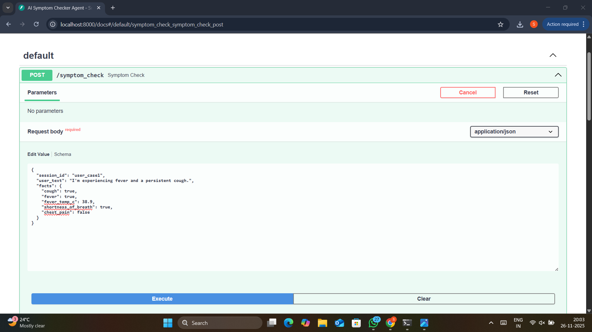
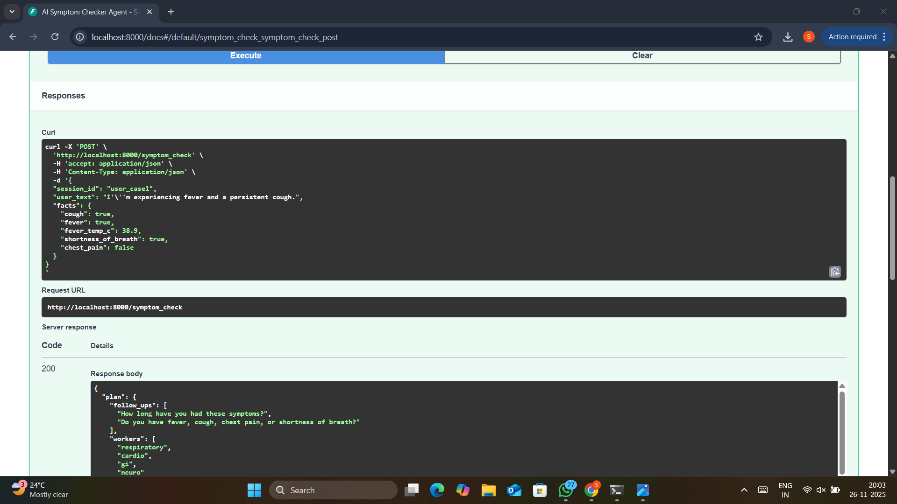
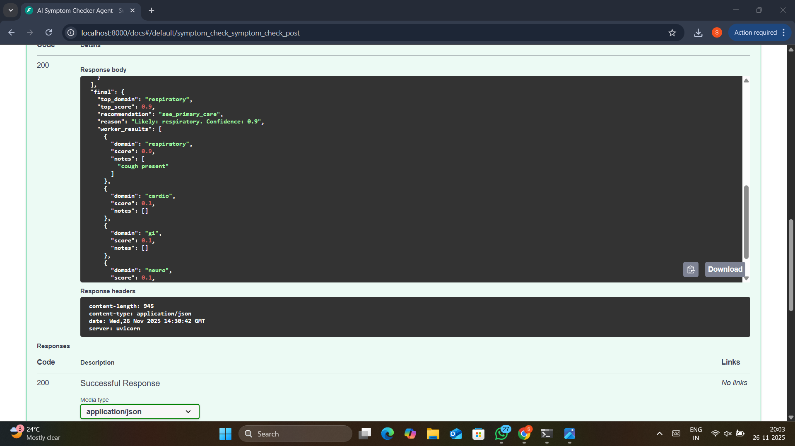
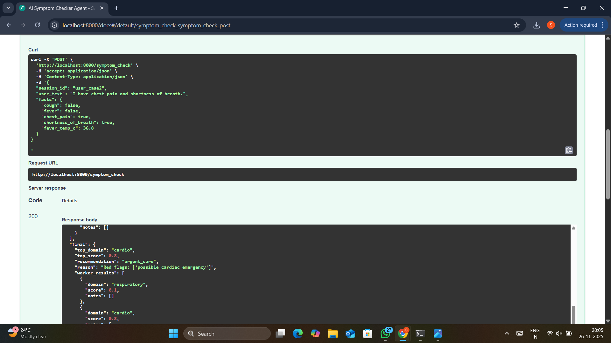
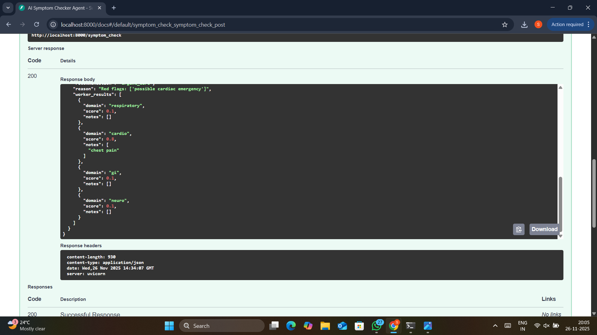
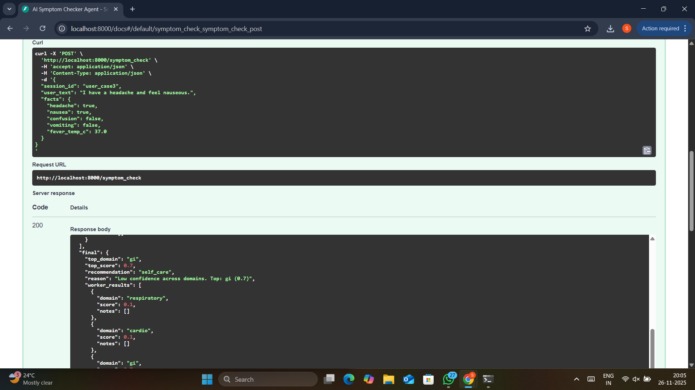
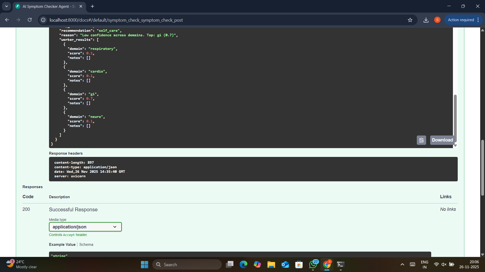

# AI Symptom Checker Agent

## Overview
A multi-agent conversational triage assistant that asks guided clinical questions, runs parallel hypothesis analyses, and provides conservative next-step recommendations.

## Features
- Planner Agent (LLM-powered) for follow-up question planning
- Parallel Symptom Analysis Agents (respiratory, cardiovascular, GI, neuro)
- Medical Safety Evaluator Agent with red-flag detection
- Custom tools (Vitals processing), session state and optional long-term memory
- Observability: structured logs and simple metrics
- Pause/resume support for long-running tasks

## Quickstart (local)
1. Clone repo
2. Create virtual env:

python -m venv .venv
source .venv/bin/activate # or .venv\Scripts\activate on Windows
pip install -r requirements.txt
3. Run:

uvicorn main:app --reload
4. Open `http://localhost:8000/docs` for the API UI.

## Files
- `main.py` - FastAPI endpoint and orchestration
- `agents/` - Planner, Worker, Evaluator implementations
- `tools.py` - VitalsTool and helpers
- `memory.py` - Session and long-term memory
- `llm_client.py` - LLM interface (stub - configure with provider)
- `requirements.txt` - Python deps

## Deployment
- Cloud Run / Agent Engine recommended. See DEPLOYMENT.md for steps.

## Safety
- Not a medical device. Provide clear disclaimer.
- Conservative recommendations by default.

## How It Works

When a user submits their symptoms, the Planner Agent generates relevant follow-up questions. Multiple Worker Agents (for respiratory, cardiac, GI, neuro domains) score symptom severity in parallel. The Evaluator Agent reviews risk scores and red-flags to safely recommend next steps, such as home care, seeing a doctor, or urgent intervention. All tasks are logged for review.

### Example API Interactions

  
User submits symptoms of fever and persistent cough. Shows how the agent detects a possible respiratory issue and asks targeted follow-up questions.

  
Agent response for a mild symptom profile: recommends “self_care” and explains low severity, demonstrating conservative triage logic for safe outcomes.

  
Details parallel scores from worker agents for different body domains, confirming transparency and explainability in clinical reasoning.

  
Highlights formatted input and agent’s adaptability to varied ways users express their clinical symptoms.

  
Shows logic for benign headache and nausea—agent advisement for self-care at home, emphasizing safety and caution.

  
Full example of how the system aggregates and analyzes symptoms related to the gastrointestinal domain and gives structured feedback.

  
Shows agent response for chest pain/shortness of breath—system raises urgent care recommendation and flags possible cardiac emergency.

## Limitations & Disclaimer

This agent provides only conservative triage recommendations—it does **not** diagnose conditions, and is **not a substitute for professional medical advice, diagnosis, or treatment**. Always consult a qualified physician for any serious symptoms.

